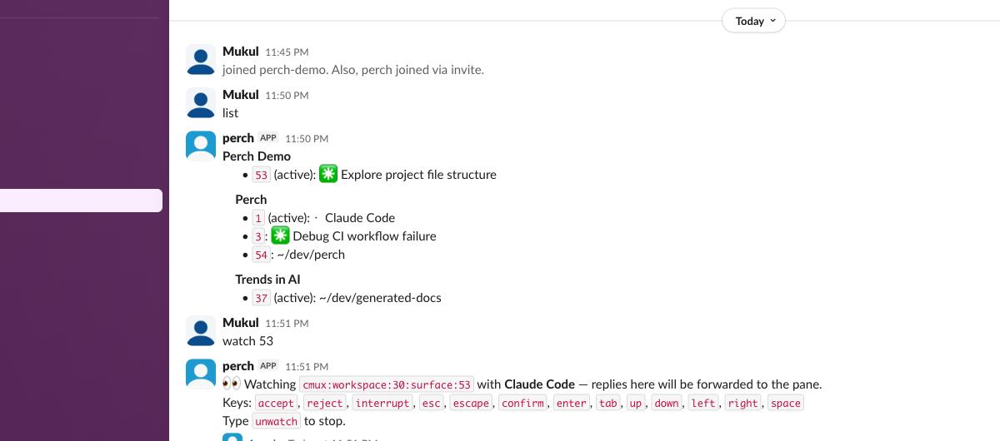
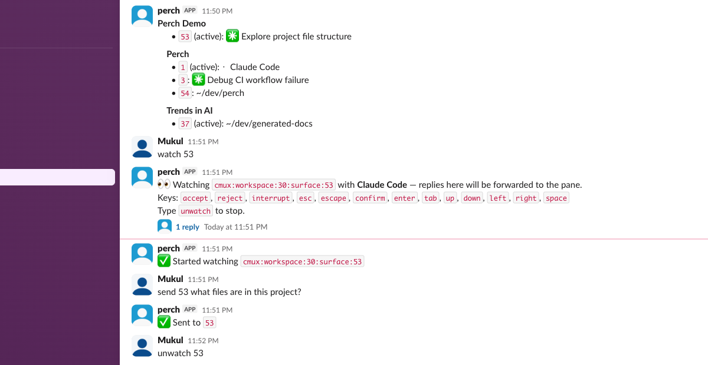

# Perch: remote-control your terminal from Slack

[](https://github.com/elitecoder/perch)
[](https://nodejs.org/)
[](./LICENSE)
[](https://github.com/elitecoder/perch/issues)

Send a Slack message. Control your terminal. Watch Claude Code think in real time.

Perch is a macOS daemon that bridges Slack and your terminal multiplexer — tmux, cmux, or Zellij.
List sessions, read output, send commands, and **watch panes live** — all from your phone, tablet, or any device with Slack.

*No SSH tunnels. No port forwarding. No VPN. Just Slack.*

---

**Install:**

```bash
curl -fsSL https://raw.githubusercontent.com/elitecoder/perch/main/scripts/install.sh | bash
```

## Why Perch

You're running Claude Code on a beefy workstation at home. You step away. Now what?

- SSH from your phone? Painful.
- Leave a browser tab open? Fragile.
- Hope the agent finishes? Risky.

**Perch lets you stay in the loop from anywhere Slack works** — which is everywhere.

It's designed to be:

- **Instant** — type `list` in Slack, see your sessions. Type `send 5 echo hello`, it happens.
- **Live** — `watch` a pane and get a single updating message with real-time output, not a flood of notifications
- **Smart** — the Claude Code preset detects thinking/waiting/idle/error states and shows transitions
- **Unobtrusive** — runs as a macOS LaunchAgent, starts on login, credentials in Keychain
- **Simple** — one `perch setup` command configures everything: Slack app, tokens, daemon

---

## Demo

> **Talk to Claude Code from Slack — on any device.**

**List sessions, watch with Claude Code preset, and send commands — all from Slack:**



**Send tasks to Claude Code remotely and watch the response live:**



The watch message **edits in place** — no message flood, just one updating thread.

---

## Quick Start

```bash
# 1. Install
curl -fsSL https://raw.githubusercontent.com/elitecoder/perch/main/scripts/install.sh | bash

# 2. Setup (creates Slack app, stores tokens, starts daemon)
perch setup

# 3. Go to your Slack channel and type:
#    list
```

That's it. You're remote-controlling your terminal from Slack.

## Slack Commands

### Terminal

```
list                      List all sessions, windows, and panes
tree [session]            Show session tree
read <pane> [lines]       Read pane output (default 50 lines)
send <pane> <text>        Send text + Enter to a pane
key <pane> <keystroke>    Send a single keystroke (e.g. Escape, C-c)
```

### Watch

```
watch <pane> [--preset]   Start watching a pane live
unwatch <pane>            Stop watching
watching                  List currently watched panes
preset <plugin>           Set global default preset
preset <pane> <plugin>    Override preset for a specific pane
```

### Workspace

```
new session <name>        Create a new session
new split <dir> <pane>    Split pane (left/right/up/down)
rename <target> <name>    Rename a session
close <target>            Close a session
select <pane>             Switch active pane
```

### System

```
help                      Show command list
status                    Daemon status, uptime, active watches
```

## Watch Presets

| Preset | What it does |
|--------|-------------|
| `claude` | Tracks Claude Code states: thinking, waiting, idle, error. Shows transitions. Key aliases: `accept`, `reject`, `interrupt`. |
| `generic` | Works with any terminal process — raw output diffing, no state awareness. |

The first `watch` auto-detects and saves the best preset. Override per-pane with `preset <pane> <id>`.

## CLI

```bash
perch setup      # Interactive setup wizard
perch status     # Check daemon status
perch restart    # Restart the daemon
perch logs       # Tail daemon logs
perch uninstall  # Remove everything cleanly
```

## How It Works

```
Slack message → Perch daemon → terminal multiplexer → your pane
                     ↓
              reads output → posts back to Slack
```

Perch runs as a LaunchAgent (`~/Library/LaunchAgents/dev.perch.plist`) that:
1. Connects to Slack via Socket Mode (real-time, no webhooks)
2. Translates your messages into terminal multiplexer commands
3. For watched panes, polls output and edits a single Slack message in-place

Credentials are stored in macOS Keychain (service `dev.perch`). Config lives at `~/.config/perch/config.json`.

### Architecture

```
packages/
  shared/     Shared config types and read/write utilities
  cli/        CLI tool — setup, status, restart, logs, uninstall
  daemon/     Background daemon — Slack socket, terminal adapters, watcher engine
scripts/      Install script
slack/        Slack app manifest
launchd/      LaunchAgent plist template
```

## Supported Multiplexers

| Multiplexer | Detection |
|-------------|-----------|
| **tmux** | `which tmux` |
| **cmux** | App bundle or `which cmux` |
| **Zellij** | `which zellij` |

## Install / Update / Uninstall

```bash
# Install (or update — same command)
curl -fsSL https://raw.githubusercontent.com/elitecoder/perch/main/scripts/install.sh | bash

# Uninstall
perch uninstall
```

Requires Node.js 20+. Installs to `~/.perch`, links `perch` globally.

## Configuration

```json
{
  "slackChannelId": "C...",
  "pollIntervalMs": 2000,
  "maxScreenLines": 50,
  "adapterPriority": ["cmux", "tmux", "zellij"],
  "defaultPreset": "claude",
  "panePresets": {}
}
```

## Contributing

Contributions welcome! Open an issue or PR at [github.com/elitecoder/perch](https://github.com/elitecoder/perch).

## License

Apache 2.0
